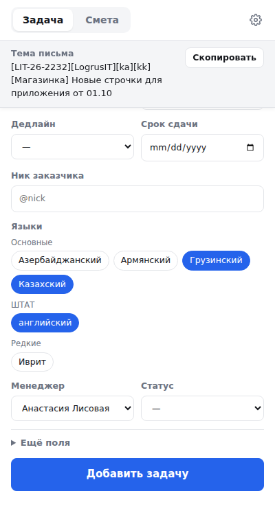
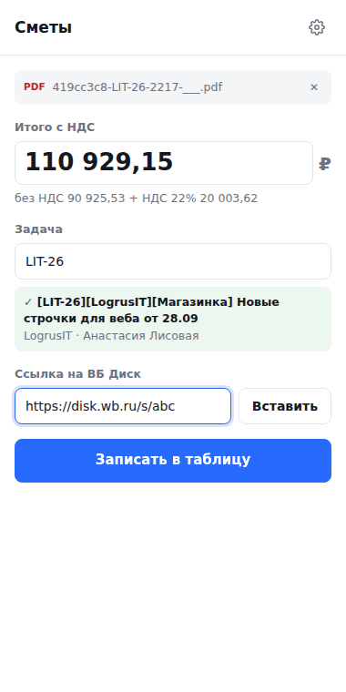

# Задачи и сметы (пробная версия)

Боковая панель Chrome с тремя вкладками:

- **Новая задача** — добавить задачу менеджера в таблицу, не открывая её. Поля и шаблоны те же, что в окне
  «➕ Добавить задачу»; номер (`LIT-26-2232`), тема с кодами языков и цвета — тоже.
- **Мои задачи** — ваши открытые задачи: сначала просроченные, потом по сроку. Статус меняется прямо в списке,
  закрытые пропадают. На иконке расширения — число просроченных (обновляется раз в полчаса).
  Фильтр сверху: **Открытые · Отданные · Отменённые · Все**, рядом — сколько задач в каждом. Закрытые и «Все» — свежие
  сверху (последние 100).
  **«Изменить»** открывает задачу целиком: тема, ссылки на Band, тикет, даты, продукт, языки, сроки, статусы,
  смета, SP, комментарий. Сверху — поиск любой задачи (номер, тикет, тема, ник, комментарий), не только своих.
  Внизу окна правки — «Удалить задачу»: спросит подтверждение, отменить нельзя.
- **Смета** — записать итог с НДС и ссылку с ВБ Диска в строку задачи (подробно ниже).

## Разделы

Внизу панели — пять разделов: **Задача · Мои · Смета · Отчёты · Письма**. Сверху — название раздела,
«▦» (открыть таблицу), «☾/☀» (тема) и «⚙️» (настройки).

**Отчёты** — те же, что «📈 Отчёты» в таблице, плюс «Считать по дате поступления / закрытия»:
- По менеджеру — для Band: человек, месяц (по дате поступления или закрытия) → все тикеты за месяц;
  «📋 Скопировать для Band» — готовый текст: ссылка внутри названия задачи и «— 5 SP»; «📥 Скачать Excel».
- Кастомный — для руководства: продукты, языки, топы; Excel.
- Сверка с подрядчиками — месяц, подрядчик, менеджер, язык; сводка пересчитывается сама; Excel.
Excel собирает таблица и присылает в расширение — файл сразу в «Загрузках», доступ к чужому Диску не нужен.

**Письма** — своя почта для писем (колонка M «Списков») и включение рассылок для всей команды
(сводка по понедельникам, горящие сроки каждый день, незаполненные поля 26-го). «Прислать мне сейчас» — только вам.

После обновления скрипта: новое развёртывание веб-приложения и «Разрешить» доступ к Диску и внешним запросам
(для Excel) — Google спросит сам при развёртывании.

**✉️ Почта** (в «Моих задачах» у каждой задачи с номером) — открывает Outlook (mail.rwb.ru/owa; уже открытую
вкладку или новую) и ищет письма по номеру задачи, например `"LIT-26-2217"`. Номер заранее копируется:
если Outlook не успел загрузиться и поиск не запустился, расширение так и скажет — вставьте номер в поиск (Ctrl+V) и Enter.

**Письмо подрядчику** (экран «Добавлено») — почты «Кому» и «Копия» этого подрядчика и текст по его шаблону
(тема письма = тема задачи; в тексте можно {номер} {языки} {коды} {срок} {продукт} {менеджер} {ссылка}; штатные языки в письмо не попадают): скопировать по частям
или «✉️ Новое письмо в Outlook» — откроется новое письмо уже с адресами, темой и текстом.
Почты и шаблон задаются один раз на подрядчика («✏️ Настроить») и уходят в файл вместе с шаблонами задач.

## Вкладка «Новая задача»

Подрядчик и тема обязательны, остальное — по желанию; редкие поля спрятаны в «Ещё поля».
Если переписок в Band несколько — вставьте их в «Ещё ссылки на Band», каждую с новой строки: в таблице они встанут
после темы как «(ссылка 2)», «(ссылка 3)».
Тема, которая заканчивается на «от» (`Перевод строчек Android и iOS от`), сама получает дату из поля «Дата»:
`… от 01.10`. Так удобно делать шаблоны — дата каждый раз будет сегодняшней.

**Шаблоны**: заполните форму и нажмите «Сохранить» рядом с «Шаблон». Потом выбираете шаблон — подрядчик, тикет, тема,
продукт, языки и т. д. заполнятся сами, а дата в теме станет сегодняшней. Шаблоны у каждого свои; «Скачать шаблоны»
сохраняет их в файл, «Загрузить из файла» добавляет шаблоны коллеги. Тот же файл понимает окно «Новая задача» в таблице.
Перед добавлением расширение проверяет, нет ли уже задачи с той же ссылкой на Band или той же темой и тикетом.
Менеджером подставляетесь вы: «Кто вы» выбирается один раз в ⚙️ Настройках. После добавления тему можно скопировать
одной кнопкой — она уже с номером, как её собирает таблица.

Номер задачи — **подрядчик-год-номер** (`LIT-26-2232`), как в старой таблице и в именах смет.
Нумерация продолжается со старой таблицы: последние номера оттуда вписаны в `TASK_ID_START`
в `Код.gs` (папка [`table-scripts`](../table-scripts)).

Дедлайн выбирается сам, когда поставили срок сдачи (считается от «Даты получения»); его можно поменять.
После добавления — кнопка «Открыть в таблице ↗» (сразу на строку задачи).

В шапке: «▦» — открыть таблицу, «☾/☀» — светлая или тёмная тема (пока не нажимали — как в системе).

## Вкладка «Смета»

**Загрузка на ВБ Диск сама.** Оставьте поле «Ссылка на ВБ Диск» пустым и нажмите «Загрузить на ВБ Диск и записать»:
расширение создаст папку с темой письма внутри папки из настроек (по умолчанию `localization/Сметы`; в настройки можно
вставить и ссылку на папку из адресной строки диска), положит туда PDF и запишет
в таблицу сумму и ссылку `disk.wb.ru/f/…`. ВБ Диск — это Nextcloud, и он пускает такие запросы только со своей
страницы, поэтому расширение работает во вкладке disk.wb.ru (нет открытой — откроет в фоне). Вы должны быть
на диске вошедшей. Вставили ссылку сами — загрузки не будет, только запись.
Подрядчик прислал новую смету, а в папке уже лежит старая — расширение спросит: «ОК» — заменить (старая уйдёт
в корзину ВБ Диска, её можно восстановить), «Отмена» — оставить обе (новая с тем же именем сохранится как `… (2).pdf`).
В таблицу в любом случае запишется ссылка на новую.

**Оформление «Лаванда».** Светлая лаванда с фиолетовыми акцентами; если в системе тёмная тема — тёмная лаванда.
Шрифт Onest лежит в папке `fonts` (лицензия SIL OFL, `fonts/OFL.txt`) — ничего устанавливать не нужно.

**Шаблоны — кнопками.** В «Новой задаче» шаблоны стоят кнопками: один клик — подрядчик, тикет, языки, продукт и тема
заполнены. «↻ Как в прошлый раз» повторяет последнюю добавленную задачу (кроме ссылок), после добавления есть
«Ещё одну такую же». Выбрали подрядчика — расширение подскажет «как обычно» с ним (его шаблон или прошлую задачу).
В «Мои задачи» у каждой задачи кнопка «Похожая» — новая задача по её образцу. Скачать / загрузить шаблоны файлом — в ⚙️.

**Задачи нет в таблице.** Можно просто загрузить PDF на ВБ Диск: кнопка станет «Только загрузить на ВБ Диск»,
в таблицу ничего не запишется, а ссылку на файл покажет с кнопкой «Скопировать». Название папки — в поле
«Папка на ВБ Диске»: по умолчанию там тема письма (или номер задачи), но можно вписать любое.

**Обновлённая смета.** Перед заменой расширение покажет, как меняется сумма: «Было 102 641,64 ₽ → станет 105 210,30 ₽,
разница +2 568,66 ₽». Прежняя сумма и ссылка не теряются — они остаются в заметке к ячейке суммы
(«07.10.2026 — смета обновлена (версия 2): было … → стало …»). Номер версии берётся из шапки сметы.

**Суммы без округления.** Итог с НДС записывается ровно как напечатан в смете. Если в нём есть доли копейки
(«1 220,005»), расширение предупредит и запишет как есть, а таблица покажет три знака после запятой.

Расширение для Chrome. Вы кидаете в него PDF-смету, и оно само берёт **номер** из имени файла:
всё, что стоит до `-РВБ` / `-RWB`, и есть номер. Например, `LIT-26-2203-РВБ.pdf` → `LIT-26-2203`,
`HELLO-3123-2133132-RWB.pdf` → `HELLO-3123-2133132`. Настраивать ничего не нужно.
Если в имени файла нет «РВБ», номер ищется по шаблону вида `LIT-26-2203`: сначала в имени файла, потом внутри PDF.

В колонке «№ задачи» сначала ищется номер целиком, а если такой строки нет, то `LIT-26` (без последней части).
Итог с НДС находится в самой смете. Потом вы вставляете ссылку с ВБ Диска, и сумма со ссылкой записываются в нужную строку
листа «📌 Задачи (менеджеры)».

Итог ищется по арифметике, без привязки к подписям: в PDF находится тройка «без НДС + НДС = с НДС».
Поэтому сумма берётся правильная, даже если в смете куча промежуточных итогов.

### Как это выглядит в работе

1. Скачать PDF из письма в Outlook и загрузить на ВБ Диск, как сейчас. Скопировать ссылку.
2. Нажать на иконку расширения. Справа откроется панель, она не закрывается при переключении вкладок.
3. Перетащить PDF в панель. Появятся задача, сумма и тема письма из таблицы, чтобы было видно, что строка та.
4. Нажать 📋, чтобы вставить ссылку из буфера, и потом «Записать в таблицу».

Если в строке уже есть смета, расширение спросит, перезаписывать ли её.

## Установка: один раз

### 1. Скрипт-приёмник в Google (делает владелец таблицы)

1. Откройте [script.google.com](https://script.google.com), нажмите «Создать проект» и назовите его, например, «Сметы из расширения».
   Лучше сделать отдельный проект, чтобы не трогать основной скрипт таблицы.
2. Вставьте содержимое файла [`apps-script/Smeta.gs`](apps-script/Smeta.gs) вместо того, что там есть.
3. Только если это отдельный проект (не внутри таблицы): в строке `const SMETA_SPREADSHEET_ID = '';` впишите ID таблицы —
   кусок адреса между `/d/` и `/edit`. Если скрипт лежит в самой таблице (как с `ВсёВОдном.gs`), ID не нужен.
4. Сверху выберите функцию `setupSmetaToken` и нажмите «Выполнить». Google попросит доступ к таблице, разрешите.
   Внизу, в «Журнале выполнения», появится **токен**. Скопируйте его.
5. «Начать развёртывание» → «Новое развёртывание» → тип «Веб-приложение»:
   - Выполнять как: **Я**
   - У кого есть доступ: **Все**
   - Нажмите «Развернуть» и скопируйте **адрес веб-приложения** (заканчивается на `/exec`).

Без токена скрипт ничего не запишет, поэтому доступ «Все» безопасен, пока токен знают только свои.
Если вы потом поменяете код скрипта, сделайте «Управление развёртываниями» → ✏️ → Версия: «Новая версия».
Так адрес останется прежним.

### 1б. Для вкладки «Новая задача» (один раз)

`Smeta.gs` должен лежать **в проекте самой таблицы** (Расширения → Apps Script), не отдельным проектом:
вкладка вызывает те же функции, что и окно «➕ Добавить задачу». Кроме того, в проекте должен стоять новый `Код.gs` из папки
[`table-scripts`](../table-scripts): установка описана в её README. После замены кода сделайте
«Управление развёртываниями» → ✏️ → «Новая версия».

### 2. Расширение (каждый менеджер у себя)

1. Скачайте папку `smeta-extension` (например, архивом репозитория) и распакуйте.
2. В Chrome откройте `chrome://extensions` и включите «Режим разработчика» справа сверху.
3. Нажмите «Загрузить распакованное расширение» и выберите папку `smeta-extension`.
4. Закрепите иконку (🧩 → 📌), откройте панель и в «⚙️ Настройках» впишите адрес веб-приложения и токен,
   а в «Кто вы» выберите себя из списка менеджеров. Это подставится в новые задачи и во вкладку «Мои задачи».

## Если не грузится

Откройте адрес веб-приложения (`…/exec`) в обычной вкладке. Должно написать «Скрипт работает».
Если там ошибка или просьба войти:

- **«…has already been declared»**: в проекте Apps Script код лежит дважды. Оставьте либо один `ВсёВОдном`,
  либо отдельные файлы, но не то и другое вместе.
- **Просит войти в аккаунт**: «Управление развёртываниями» → ✏️ → «У кого есть доступ: **Все**».
- После любой замены кода: «Управление развёртываниями» → ✏️ → Версия «Новая версия» → «Начать развёртывание».

Расширение тоже показывает, что ответил Google, под полем «Кто вы» или внизу вкладки.

## Что пока не умеет

- Сумма с НДС проверена только на сметах LogrusIT. У других подрядчиков вёрстка может отличаться:
  пришлите пример, и я проверю. Если сумма не нашлась, её можно вписать вручную.
- Загрузка на ВБ Диск проверена только на имитации Nextcloud: на настоящем диске могут быть свои ограничения.

## Для разработки

Тесты разбора (Node 20+): `cd smeta-extension && node --test test/*.mjs`.
Чтобы проверить на настоящей смете, установите `pdfjs-dist` и запустите `SMETA_PDF=путь/к/смете.pdf node --test test/*.mjs`.
`vendor/` содержит pdf.js 4.10.38 (Apache-2.0).
